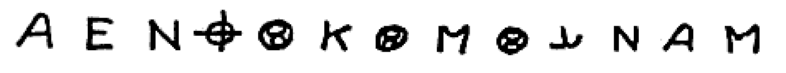
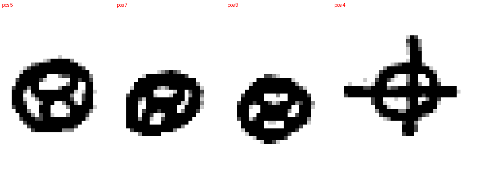
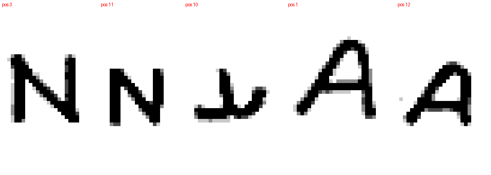
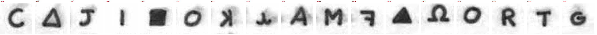
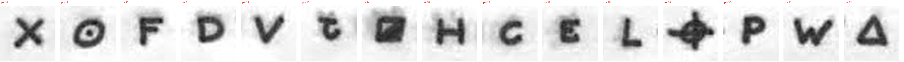
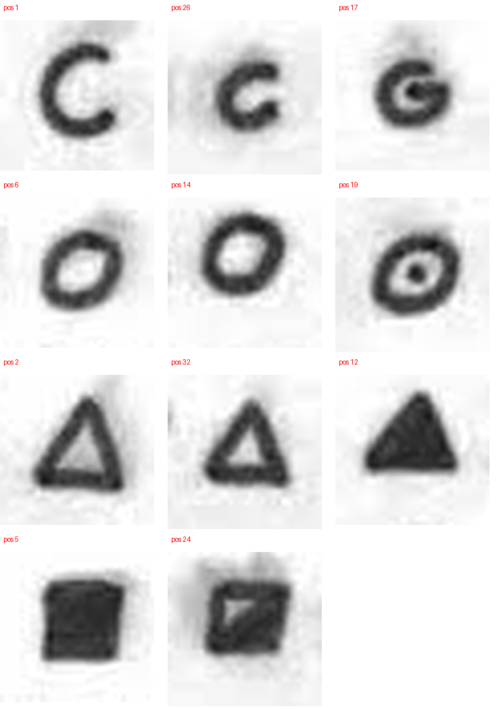

# 方向 A 报告：争议字形核对

> 日期：2026-09-25 · 对应路线图方向 A（[roadmap.md](roadmap.md)）与 [m4-report.md](m4-report.md) §5 的第 1 项。
> 对比图由 `scripts/glyph_sheets.py` 生成，存于 [`data/glyphs/`](../data/glyphs/)；敏感性分析见 `scripts/glyph_sensitivity.py` 与 `results/glyph_sensitivity.json`。

## 1. 使用的图像

| 文件 | 内容 | 分辨率 | 性质 | 来源 |
|---|---|---|---|---|
| `Zodiac-name.gif` | 1970-04-20 信（含 Z13） | 640×829 | **二值化 / 描摹图**（笔画粗细均匀、无灰度），每个字形约 20 像素宽 | Wikimedia Commons，公有领域 |
| `June_26_1970_Zodiac_letter.jpg` | 1970-06-26 信（含 Z32）**与所附地图** | 1746×1082 | 灰度照片级扫描，每个字形约 35 像素宽 | Wikimedia Commons，公有领域 |

曾检索更高分辨率的 Z13 图像：zodiackiller.com 使用同一张 640×829 图；Oranchak Wiki 的彩色照片仅 407×576；Wikimedia Commons 上没有找到更大的版本。**因此 Z13 的判断受图像质量限制，只能视为暂定；最终确认需要原件或旧金山纪事报 / FBI 的高清图像。**

## 2. Z13

| 问题 | 观察 | 判断 |
|---|---|---|
| 第 5、7、9 位的三个“圈 8”是否为同一符号？ | 三者都是“圆圈内写一个 8”，差别仅在倾斜与大小（第 7 位略呈椭圆，第 9 位较小） | **与同一符号一致**；在此分辨率下看不出有意区分的迹象 |
| 第 10 位字形 | 倒 T 形：竖笔，左侧平底，右侧向上回卷 | 与 Z32 第 8 位同形，支持二者同转录为 `[` |
| 第 11 位是否为反写 N？ | 与第 3 位同为正写 N（斜笔自左上至右下） | **图像不支持“反写 N”读法**；M2 中该变体（符合的名字 509 个）应视为缺乏依据 |
| 第 4 位 | 圆圈加十字，十字四臂伸出圆外（瞄准镜形） | 与 Zodiac 的签名符号一致 |
| 第 1、12 位 | 均为 A，第 12 位更倾斜 | 同一符号 |

**结论**：现有转录 `AENz0K0M0[NAM` 在可得图像下成立。M2 的核心发现——“三个圈 8 必须为同一字母”是决定性约束——**不因字形核对而改变**：图像没有提供把它们视为不同符号的依据。

## 3. Z32

### 3.1 重复符号的核对

| 重复组 | 观察 | 判断 |
|---|---|---|
| **第 1、26 位（转录均为 C）** | 第 1 位为干净的开口 C；**第 26 位较小，下端明显向内回钩**，形似缺横笔的 G；第 17 位为带横笔的 G | **新的读法争议**：第 26 位可能是与第 1 位不同的符号 |
| 第 6、14 位（均为 O） | 第 6 位为倾斜的椭圆，第 14 位较圆 | 可能只是书写差异；列为次要争议 |
| 第 2、32 位（空心三角形） | 形状一致 | 同一符号 |

### 3.2 此前标注“有争议 / 待核实”的字形

| 位置 | 转录 | 观察 | 更正 / 判断 |
|---|---|---|---|
| 4 | `\|` | 一条短竖笔，无衬线 | 维持 |
| 7 | `k` | 镜像 K（竖笔在右，两臂向左） | **确认为反写 K** |
| 8 | `[` | 倒 T 形，底部回卷 | 与 Z13 第 10 位同形 |
| 11 | `f` | 镜像 F（横笔向左） | **确认为反写 F** |
| 12 | `8` | 实心三角形 ▲ | **确认**（与第 2、32 位的空心三角形不同） |
| 19 | `6` | **圆圈中心一个点 ⊙** | 更正：此前描述为“圆圈内加 X”有误 |
| 23 | `j` | 类小写 t，底部带钩 | 更正描述（此前为“折线形”） |
| 24 | `%` | **方框，右下半涂黑、左上三角留白（◪）** | 更正：不是实心圆；与第 5 位的纯实心方框明显不同，支持二者为不同符号 |
| 29 | `z` | 圆圈加十字，四臂伸出圆外 | 与 Z13 第 4 位同形 |

## 4. 敏感性分析：Z32 第 26 位若为独立符号

| 读法 | 不同符号 | 重复组 | Z340 式密钥下 P(不同符号 ≥ 观测) | 普通英文片段符合率 | “弧度 + 英寸”文法符合（组合数） | Grinell / Cragle / Stampher 是否仍符合 |
|---|---|---|---|---|---|---|
| 原转录 | 29 | 3 | 0.573 | 3.5×10⁻⁴ | 153（65） | 是 |
| 第 26 位为独立符号 | 30 | 2 | 0.361 | 4.9×10⁻³ | 702（220） | 是 |
| 第 14 位为独立符号 | 30 | 2 | 0.358 | 5.0×10⁻³ | 1,996（339） | 是 |
| 第 14、26 位皆独立 | 31 | 1 | 0.129 | 7.2×10⁻² | 12,977（884） | 是 |

**解读**：
1. 无论采用哪种读法，Z32 的重复程度仍与 Zodiac 的 Z340 式同音替换一致（P = 0.13–0.57），M2 的结论不变。
2. 读法越宽松（重复组越少），重复模式的约束越弱：若第 26 位为独立符号，普通英文片段的符合率上升约 14 倍，文法中符合的“弧度 + 英寸”指令增至 702 条。**M3 的结论因此更强**——现有 Z32 声明的证据价值只会更低。
3. H001（Z32 沿用已知密钥）按预注册的原转录判定为“不支持”，该判定不变。若第 26 位为独立符号，Z340 密钥下的自由符号由 2 个增至 3 个，这只会让“沿用 Z340 密钥”的假设更难检验，不会使其更可信。

## 5. 小结与后续

| 项目 | 结果 |
|---|---|
| Z13 | 现有转录成立；圈 8 看不出差异；第 11 位为正写 N（排除“反写 N”变体） |
| Z32 | 发现新的读法争议（第 26 位）；更正 3 处字形描述（第 19、23、24 位）；确认 3 处（第 7、11、12 位） |
| 对已有结论的影响 | 无推翻；M3 对 Z32 声明的否定结论进一步加强 |

后续：Z13 的最终确认需要更高分辨率的原件图像。本次使用的 1970-06-26 扫描件中**包含 Zodiac 实际寄出的地图**（含比例尺 “ONE INCH EQUALS APPROX 6.4 MILES” 与 Mt. Diablo 上的 0 / 3 / 6 / 9 标记），可直接作为方向 E（地图几何）的底图，不必另行寻找 Phillips 66 地图扫描件。
